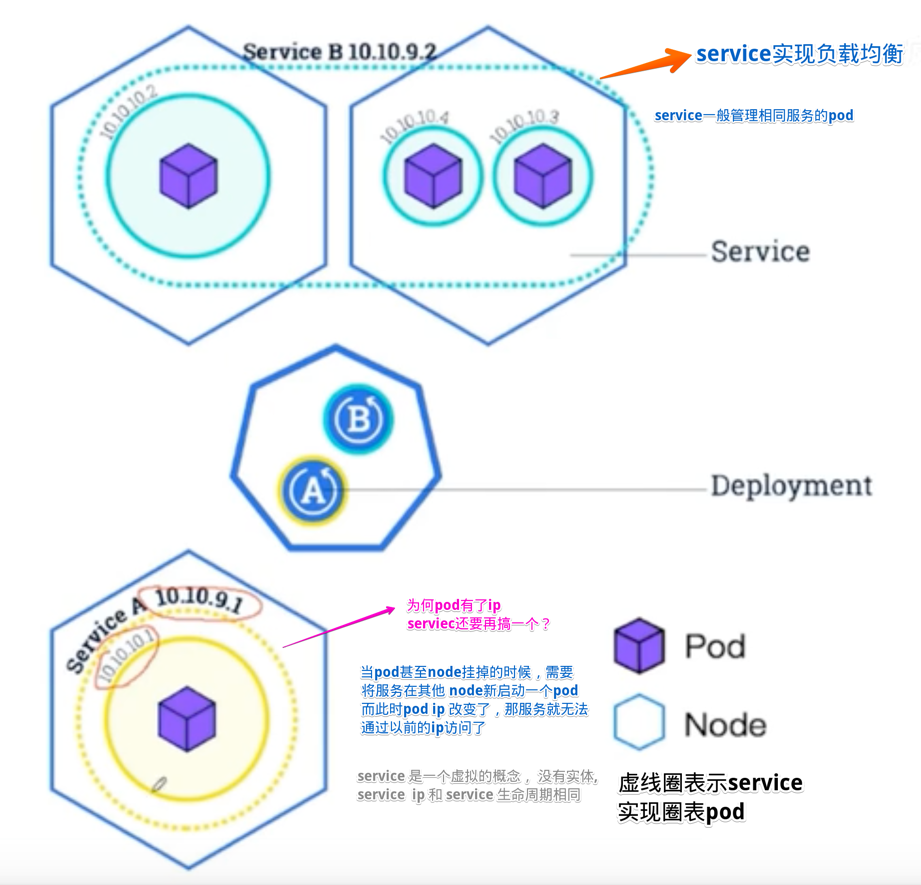

# Architecture

## 各 k8s 对象之间关系
deployment 创建 pod  

一个 node 可包含多个 pod  

service 是逻辑概念，包含多个 pod

pod 中可包含多个容器

### 总结
- Pod被ReplicaSet管理
- ReplicaSet控制pod的数量
- ReplicaSet被Deployment管理
- Deployment控制pod应用的升级、回滚，当然也能控制pod的数量
- Service提供一个统一固定入口，负责将前端请求转发给Pod。

## k8s 全景图
  
