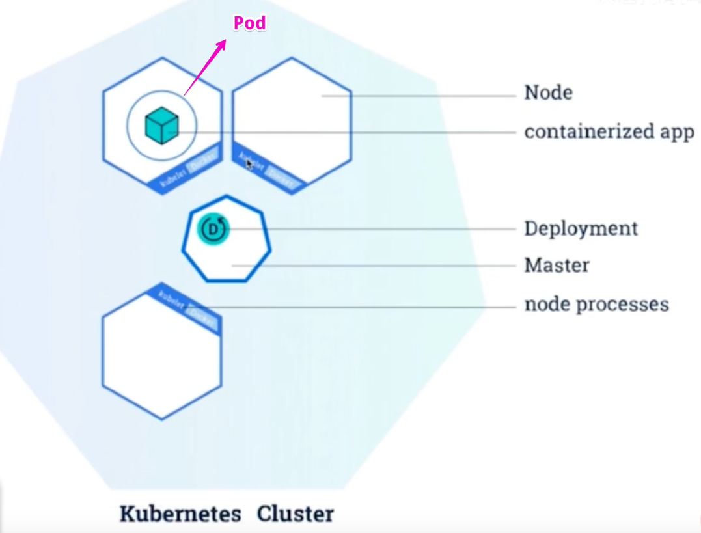
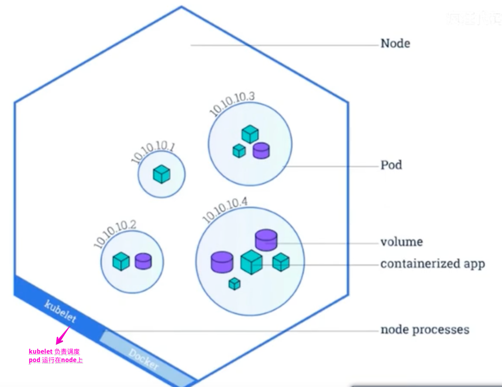
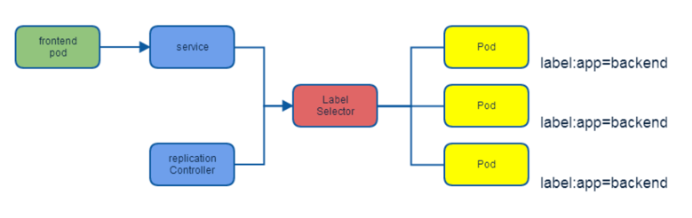
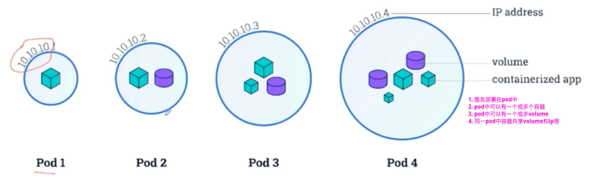
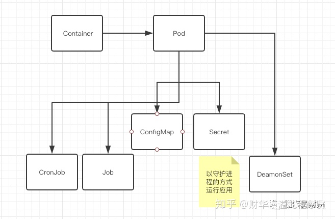
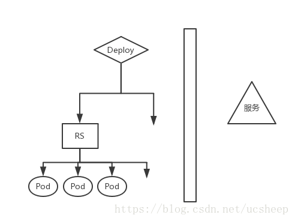
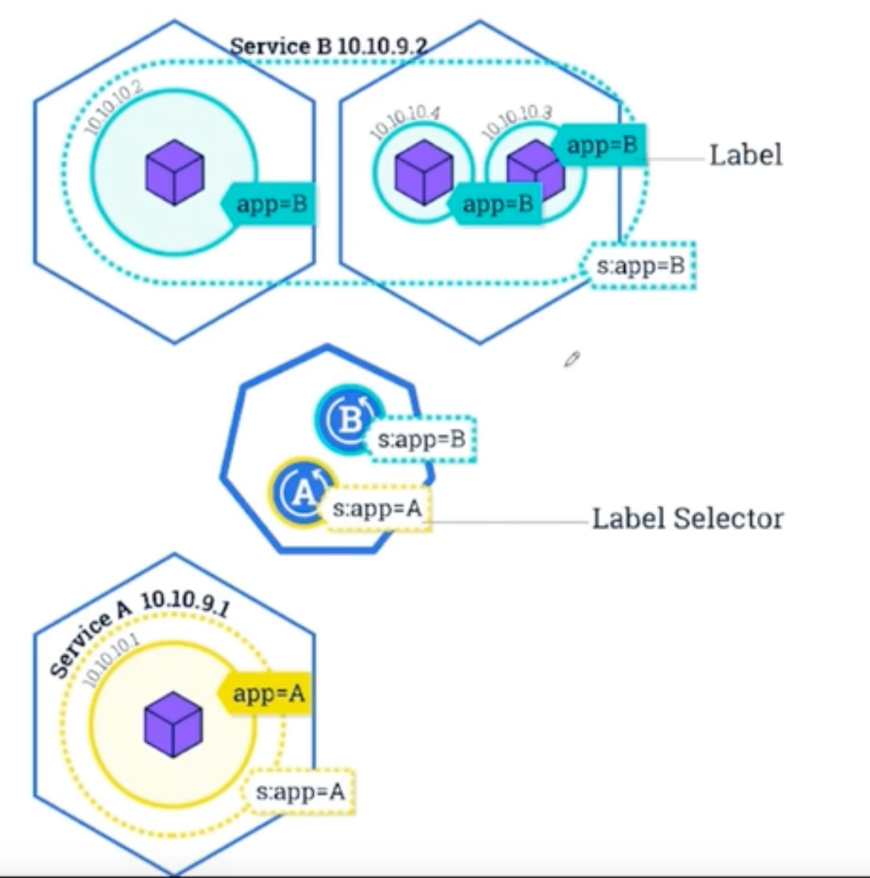

# Architecture
  

一个node可包含多个pod  
  

service  

# concept
## kubelet
[参考链接](https://www.jianshu.com/p/f888020d7dcc)  
kubelet 是运行在每个node上的主要的“节点代理”，每个节点都会启动 kubelet进程，用来处理 Master 节点下发到本节点的任务, 
按照 PodSpec 描述来管理Pod 和其中的容器（PodSpec 是用来描述一个 pod 的 YAML 或者 JSON 对象）。

kubelet 通过各种机制（主要通过 apiserver ）获取一组 PodSpec 并保证在这些 PodSpec 中描述的容器健康运行。

### kubelet 主要功能
- pod 管理：kubelet 定期从所监听的数据源获取节点上 pod/container 的期望状态（运行什么容器、运行的副本数量、网络或者存储如何配置等等），并调用对应的容器平台接口达到这个状态。
- 容器健康检查：kubelet 创建了容器之后还要查看容器是否正常运行，如果容器运行出错，就要根据 pod 设置的重启策略进行处理。
- 容器监控：kubelet 会监控所在节点的资源使用情况，并定时向 master 报告，资源使用数据都是通过 cAdvisor 获取的。知道整个集群所有节点的资源情况，对于 pod 的调度和正常运行至关重要。

## pod
在Kubernetes中，与用采用单独的应用容器方式不同，pod是最小的部署单元，可以对其进行创建，调度和管理操作。
  

- 资源共享与通讯
    - 一个pod中应用使用相同的网络命名空间/IP和端口空间，可以使用localhost找到彼此并进行通信
    - 处在同一个pod中的应用也能访问一样的的共享volume  
      有了Pod之后，同一个Pod内的容器可以共享很多信息，也可能需要读取同一份配置。
      比如Pod内有两个容器需要访问同一个数据库，那么我们可以把相关的配置信息写到
      ConfigMap里。那如果还有一些比较敏感的信息的话，就需要放到Secret对象中，
      它其实是一个保存在 Etcd 里的键值对数据。
      这样，你把 Credential 信息以 Secret 的方式存在 Etcd 里，
      Kubernetes 就会在你指定的 Pod（比如，Web 应用的 Pod）启动时，
      自动把 Secret 里的数据以 Volume 的方式挂载到容器里。

        

- [参考链接](https://hardocs.com/d/kubernetes/035-Pods.html)

### pod 通讯
[pod 通讯](./pod/pod-communication.md)
## Deployment
  

创建service 以及 pod  
Deployment用于管理Pod、ReplicaSet，可实现滚动升级和回滚应用、扩容和缩容。  

将Pod调度到目标机器上，调度完成之后，它还会继续帮我们继续监控容器是否在正确运行，
一旦出现问题，会立刻告诉我们Pod的运行不正常以及寻找可能的解决方案，
比如目标节点不可用的时候它可以快速地调度到别的机器上去。另外，如果需要对应用扩容提升
响应能力的时候，通过Deployment可以快速地进行扩展

## service
  

试想一个问题，ReplicaSet定义了pod的数量是2，当一个pod由于某种原因停止了，ReplicaSet会新建一个pod，以确保运行中的pod数量始终是2。但每个pod都有自己的ip，前端请求不知道这个新pod的ip是什么，那前端的请求如何发送到新pod中呢？
答案是使用Service  

k8s的Service定义了一个服务的访问入口地址，前端的应用通过这个入口地址访问其背后的一组由Pod副本组成的集群实例，来自外部的访问请求被负载均衡到后端的各个容器应用上。Service与其后端Pod副本集群之间则是通过Label Selector实现关联。
请说人话：前端请求不是直接发送给Pod，而是发送到Service，Service再将请求转发给pod。

### 如何定义哪些 pod 属于同一 service
  
kubelet 使用 `Label Selector` ，当定义 service 时，指定标签(比如 `app=B`), 然后搜索所有带有该 `app=B` 
标签的pod  
所以，任何pod都可以归为同一service，但一般还是同一service管理部署相同服务的pod

## ingress
对外提供服务类似与nginx

## 总结
- Pod被ReplicaSet管理
- ReplicaSet控制pod的数量
- ReplicaSet被Deployment管理
- Deployment控制pod应用的升级、回滚，当然也能控制pod的数量
- Service提供一个统一固定入口，负责将前端请求转发给Pod。