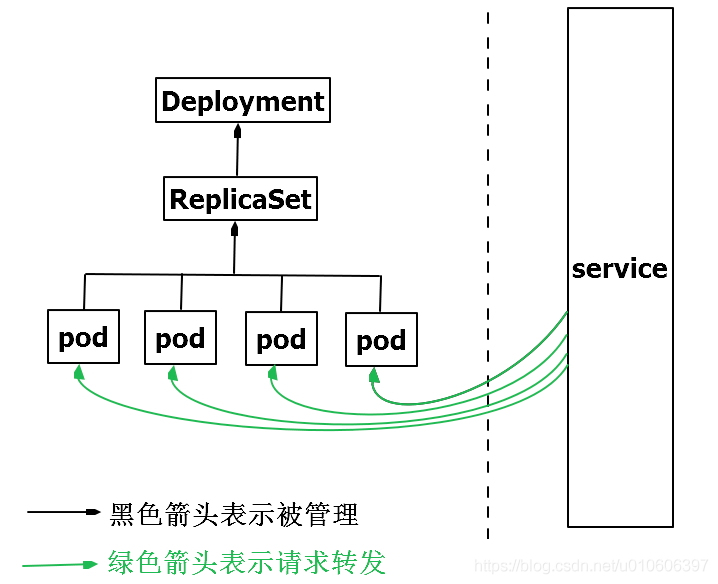

# concept
[k8s 常用对象说明](https://www.huweihuang.com/kubernetes-notes/concepts/object/kubernetes-basic-concepts.html)
## kubelet
[参考链接](https://www.jianshu.com/p/f888020d7dcc)  
一句话: 与 master 通信并报告node pod等状态， 监控pod，容器的起停等等，啥它都管，node放不下了，报告，然后将pod弄走等  
kubelet 是运行在每个 **node** 上的主要的“节点代理”，每个节点都会启动 kubelet进程，用来处理 Master 节点下发到本节点的任务, 
按照 PodSpec 描述来管理Pod 和其中的容器（PodSpec 是用来描述一个 pod 的 YAML 或者 JSON 对象）。

kubelet 通过各种机制（主要通过 apiserver ）获取一组 PodSpec 并保证在这些 PodSpec 中描述的容器健康运行。

### kubelet 主要功能
- pod 管理：kubelet 定期从所监听的数据源获取节点上 pod/container 的期望状态（运行什么容器、运行的副本数量、网络或者存储如何配置等等），并调用对应的容器平台接口达到这个状态。
- 容器健康检查：kubelet 创建了容器之后还要查看容器是否正常运行，如果容器运行出错，就要根据 pod 设置的重启策略进行处理。
- 容器监控：kubelet 会监控所在节点的资源使用情况，并定时向 master 报告，资源使用数据都是通过 cAdvisor 获取的。知道整个集群所有节点的资源情况，对于 pod 的调度和正常运行至关重要。

## Master
集群的控制节点，负责整个集群的管理和控制，kubernetes的所有的命令基本都是发给Master，由它来负责具体的执行过程。  
### Master 的组件
- API Server：提供了资源操作的唯一入口，并提供认证、授权、访问控制、API注册和发现等机制
- Scheduler：负责根据 Pod 的调度要求，将 Pod 调度到合适的节点上运行。
- Controller Manager：包含多个控制器，用于监控集群的状态并对其进行调整，例如 ReplicaSet 控制器、Deployment 控制器等。
- etcd：分布式键值存储系统，用于保存集群的配置信息、状态信息和元数据。


## Node
节点可以是一个虚拟机或者物理机器，取决于所在的集群配置。  
[Node](https://kubernetes.io/zh-cn/docs/concepts/architecture/nodes/) 是集群的工作负载节点，默认情况kubelet会向Master注册自己，一旦Node被纳入集群管理范围，
kubelet会定时向Master汇报自身的情报，包括操作系统，Docker版本，机器资源情况等。
如果Node超过指定时间不上报信息，会被Master判断为“失联”，标记为Not Ready，随后Master会触发Pod转移。
### Node 的组件
- kubelet: Pod的管家，与Master通信
- kube-proxy：实现kubernetes Service的通信与负载均衡机制的重要组件
- Docker：容器的创建和管理

### 管理
***如何添加节点？***  
向 API 服务器添加节点的方式主要有两种：  
- 节点上的 kubelet 向控制面执行自注册；
- 你（或者别的什么人）手动添加一个 Node 对象。

使用如下json创建node
```json
{
  "kind": "Node",
  "apiVersion": "v1",
  "metadata": {
    "name": "10.240.79.157",
    "labels": {
      "name": "my-first-k8s-node"
    }
  }
}

```


## pod
在Kubernetes中，与用采用单独的应用容器方式不同，pod是最小的部署单元，可以对其进行创建，调度和管理操作。  
pod中天然有一个k8s自己的容器，pause  
  

- 资源共享与通讯
    - 一个pod中应用使用相同的网络命名空间/IP和端口空间，可以使用localhost找到彼此并进行通信
    - 处在同一个pod中的应用也能访问一样的的共享volume  
      有了Pod之后，同一个Pod内的容器可以共享很多信息，也可能需要读取同一份配置。
      比如Pod内有两个容器需要访问同一个数据库，那么我们可以把相关的配置信息写到
      ConfigMap里。那如果还有一些比较敏感的信息的话，就需要放到Secret对象中，
      它其实是一个保存在 Etcd 里的键值对数据。
      这样，你把 Credential 信息以 Secret 的方式存在 Etcd 里，
      Kubernetes 就会在你指定的 Pod（比如，Web 应用的 Pod）启动时，
      自动把 Secret 里的数据以 Volume 的方式挂载到容器里。

        

- [参考链接](https://hardocs.com/d/kubernetes/035-Pods.html)  

### pod 中 pause 容器有啥用
- 网络命名空间（Network Namespace）共享：Pause 容器创建了一个独立的网络命名空间，并与其他容器共享该命名空间。这使得在同一个 Pod 中的所有容器可以使用相同的网络配置，它们可以通过 localhost 直接通信，而无需进行网络地址转换。
- 存储卷共享：Pause 容器还负责挂载和管理 Pod 的共享存储卷。其他容器可以通过卷的挂载路径访问共享的数据。这样，所有在同一个 Pod 中的容器都可以共享同一个存储卷，实现数据的共享和交互。
- Pod 生命周期管理：Pause 容器在 Pod 创建时启动，并在 Pod 销毁时终止。它的存在确保了 Pod 的生命周期，即使 Pod 中的其他容器在某些时候没有运行，Pause 容器也会一直存在。

### 静态 pod 和 普通 pod 有啥区别
- 静态 Pod 是由节点上的 kubelet 直接创建和管理的 Pod，不受控制平面的管理；
- 而动态 Pod 是通过 Kubernetes API Server 创建和管理的 Pod，受控制平面的调度和监控。

静态 Pod 适用于一些特殊的需求场景，而动态 Pod 则是 Kubernetes 中常用的创建和管理方式，通过定义资源对象来控制 Pod 的副本数、更新策略等属性。
### pod 通讯
[pod 通讯](./pod/pod-communication.md)

### pod 内一般部署什么
pod 可以共享volume等，所以pod内一般部署相互交互或者有共同文件的系统  

### pod 模版
[Pod模板](https://kubernetes.io/docs/concepts/workloads/pods/#pod-templates)用来定义Pod的各种属性，Controller(一般来说是Deployment)通过Pod模板来生成对应的Pod。  
## Deployment
  

创建service 以及 pod  
Deployment用于管理Pod、ReplicaSet，可实现滚动升级和回滚应用、扩容和缩容。  

将Pod调度到目标机器上，调度完成之后，它还会继续帮我们继续监控容器是否在正确运行，
一旦出现问题，会立刻告诉我们Pod的运行不正常以及寻找可能的解决方案，
比如目标节点不可用的时候它可以快速地调度到别的机器上去。另外，如果需要对应用扩容提升
响应能力的时候，通过Deployment可以快速地进行扩展

## Replication Controller
*新版本没有RC了，由 Deployment + Replica Set 代替*  
Replication Controller是用来控制管理Pod副本(Replica，或者称实例)，Replication Controller
确保任何时候Kubernetes集群中有指定数量的Pod副本在运行，如果少于指定数量的Pod副本，Replication Controller会启动新的Pod副本，
反之会杀死多余的以保证数量不变。另外Replication Controller是弹性伸缩、滚动升级的实现核心。


## service
  

k8s的Service定义了一个服务的访问入口地址，前端的应用通过这个入口地址访问其背后的一组由Pod副本组成的集群实例，来自外部的访问请求被负载均衡到后端的各个容器应用上。Service与其后端Pod副本集群之间则是通过Label Selector实现关联。  
请说人话：前端请求不是直接发送给Pod，而是发送到Service，Service再将请求转发给pod。


***另一张图***
  
RC保证Service的Pod副本实例数目保持预期水平。  
两张图有何区别？  
新版本中， RC没了，换为来 Deployment + Replica Set

### 如何定义哪些 pod 属于同一 service
  
kubelet 使用 `Label Selector` ，当定义 service 时，指定标签(比如 `app=B`), 然后搜索所有带有该 `app=B` 
标签的pod  
所以，任何pod都可以归为同一service，但一般还是同一service管理部署相同服务的pod

### 服务发现
[服务发现 与 三种 ip](./service/service-discovery.md)
## ingress
对外提供服务类似与nginx


## Volume
### 功能
- Volume是Pod中能够被多个容器访问的共享目录，可以让容器的数据写到宿主机上或者写文件到网络存储中
- 可以实现容器*配置文件集中化定义与管理*，通过ConfigMap资源对象来实现(参考[pod节](./concept.md#pod))。

### 与 docker 中 volume 的区别
- k8s上Volume定义在 *Pod* 上，然后被一个Pod中的多个容器挂载到具体的文件目录下。
- k8s的Volume与Pod生命周期相关而不是容器是生命周期，*即容器挂掉，数据不会丢失*，但是Pod挂掉，数据则会丢失。
- k8s中的Volume支持多种类型的Volume：Ceph、GlusterFS等分布式系统。


## Persistent Volume
- PV是网络存储，不属于任何Node，但可以在每个Node上访问。
- PV不是定义在Pod上，而是独立于Pod之外定义。
## Namespace
Namespace即命名空间，主要用于多租户的资源隔离，通过将资源对象分配到不同的Namespace上，便于不同的分组在共享资源的同时可以被分别管理。
## 总结
- Pod被ReplicaSet管理
- ReplicaSet控制pod的数量
- ReplicaSet被Deployment管理
- Deployment控制pod应用的升级、回滚，当然也能控制pod的数量
- Service提供一个统一固定入口，负责将前端请求转发给Pod
