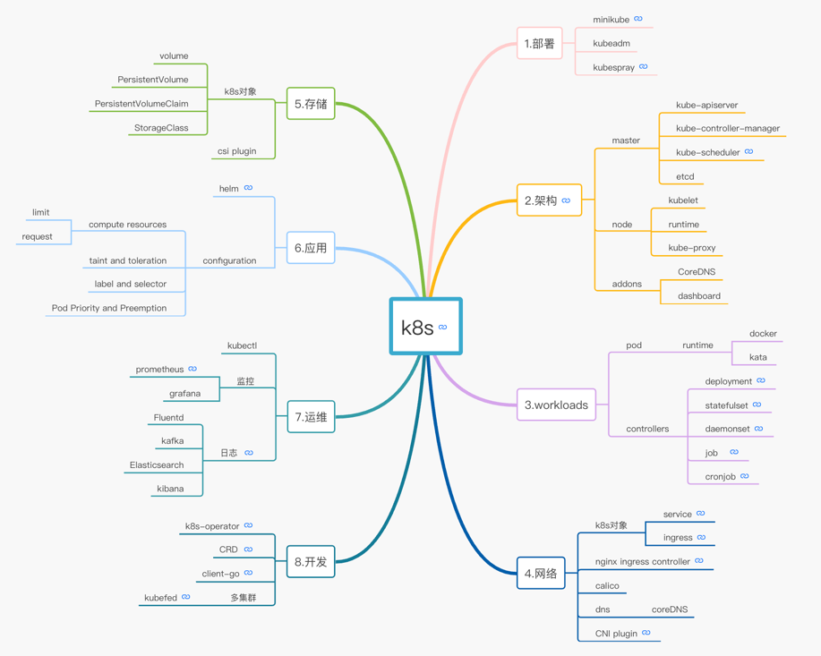

## 概览

## start
- pod.yml 中配置所要使用的 image  
  docker image ls 检查是否有配置的image 如果没有请配置
  eval $(minikube docker-env) 并重新 build image
- 创建pod  
  kubectl create -f pod [podName]  
  如果想将pod中的container端口暴露出去，除了使用service管理之外，还可以使用port-forward  
  kubectl port-forward k8s-demo-deployment-55f85b5989-wbdc5 28000:8080
- service.yml 中配置所要启动的pod
- 创建service  
  kubectl create -f service [serviceName]  
  minikube service k8s-demo-svc --url  展示在浏览器中输入的地址
- 创建deployment.yml  通过deployment.yml创建pod