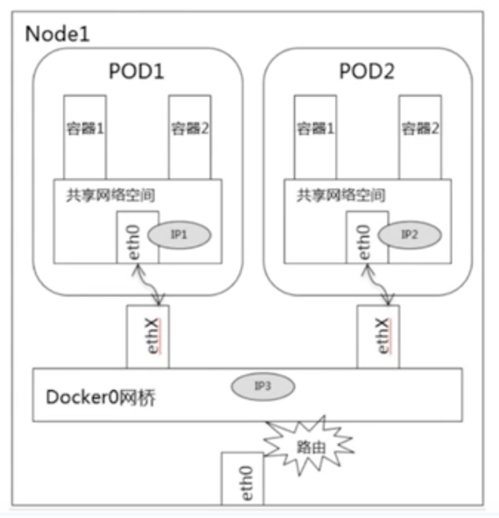
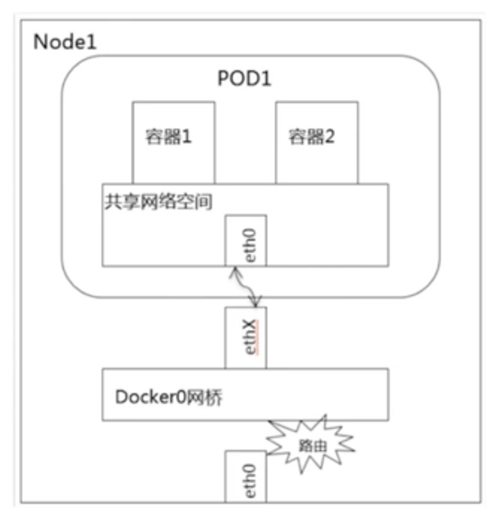

# kubernetes Pod 通讯
## pod 间通信
### 同一 node
  
#### 通过 pod ip 访问
同一node下的 pod 默认路由都是 `Docker0`， 由于关联在同一网桥 `Docker0` 上，所以地址网段相同，可以直接通过
内网桥进行通信，方式就是通过 `pod ip` 可以直接访问  

问题来了，这是一个好的实践吗？
##### Replicas 数量为 1
由于 `deployment`  创建 `rs`， `rs` 再创建 `pod`, 如果 `pod` 挂掉，k8s 会再启动一个 `pod` ，此时ip变了，
也就无法访问了
##### Replicas 数量为 多个
replicas 多个 pod 是为了负载均衡， 直接写死 pod ip , 无法进行负载均衡

#### pod 提供 service， 通过service 访问服务
通过service可以应对pod ip 变化问题。  
但有个疑问, 如果有些内部服务，通过service暴露出去了，这不是我期望的。 是不是通过service暴露出去了也可以做到外界访问不了？ 

### 不同 node
最简单的方式:  直接通过service
## pod 内部通信
  
什么都是共享的，直接 `localhost:端口号` 访问
