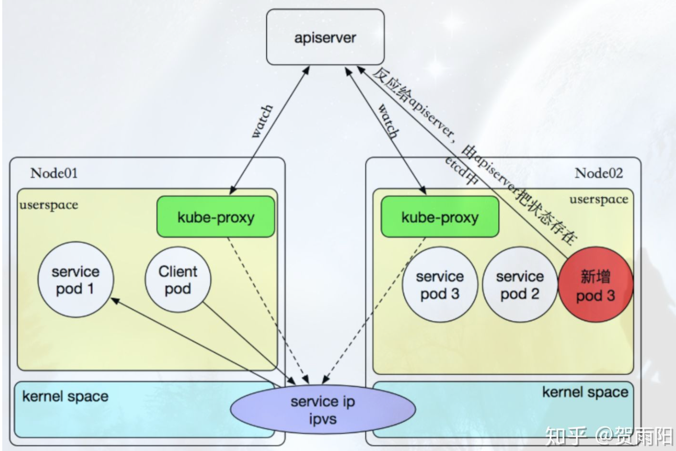

# k8s service  服务发现
## service
[service 概念](../concept.md#service)
## k8s 中的三种IP
### Pod IP
它是Docker Engine根据docker0网桥的IP地址段进行分配的, 不会冲突
### Cluster IP 
Cluster IP是一个虚拟的IP，仅仅作用于Kubernetes `Service`这个对象，
由Kubernetes自己来进行管理和分配地址，当然我们也无法ping这个地址，
他没有一个真正的实体对象来响应，他只能结合Service Port来组成一个可以通信的服务,
相当于VIP地址，来代理后端服务。  
也就是 service IP
### Node IP
Node IP是Kubernetes集群中节点的物理网卡IP地址(一般为内网)，
属于这个网络的服务器之间都可以直接通信，所以Kubernetes集群外要想访问Kubernetes
集群内部的某个节点或者服务，肯定得通过Node IP进行通信（这个时候一般是通过外网IP了）

## 服务发现
服务发现是什么？  
因为Pod存在生命周期，有销毁，有重建，无法提供一个固定的访问接口给客户端。并且可能同时存在多个副本的。
因此服务发现就是为Pod对象提供了一个固定、统一的访问接口和负载均衡能力。这也就是 `service` 为什么存在
### Kube-proxy
在 Kubernetes 集群中，每个 Node 运行一个 kube-proxy 进程。
kube-proxy 负责为 Service 实现了一种 VIP（虚拟 IP）的形式。  
**service 其实就是由kube-proxy和iptables来实现的**
  

#### type: ClusterIP
只能集群内部访问，并且ip固定，只要service不删除，他就在  
会弄一个iptables，给相关pod弄虚拟ip，然后将虚拟ip流量重定向到后端服务

#### type:  NodePort
在每个node上都起监听端口，把服务暴露在节点上，这样可以让集群外部的服务，
通过 NodeIp 和 NodePort 访问到集群内部的服务

### Kube-DNS
是k8s的一个插件，负责集群内部的DNS解析, 可以在集群内部，通过访问pod的名字就可以进行通信